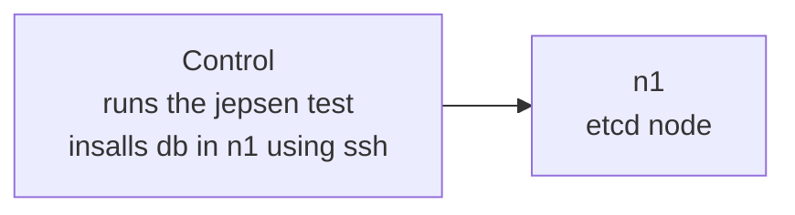

# jepsen-etcd

Jepsen etcd test in docker compose



## Todo
- continue from here - https://github.com/jepsen-io/jepsen/blob/main/doc/tutorial/03-client.md

## Run on local

```bash
mise install

just up-build

docker exec -it control /bin/bash

# inside control container shell
cd jepsen
lein run test --node n1
```
