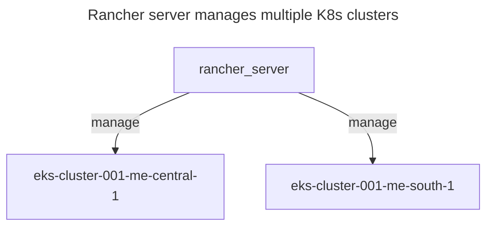
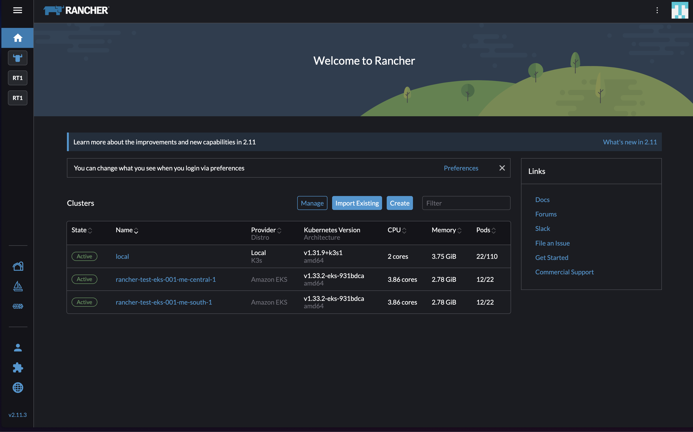
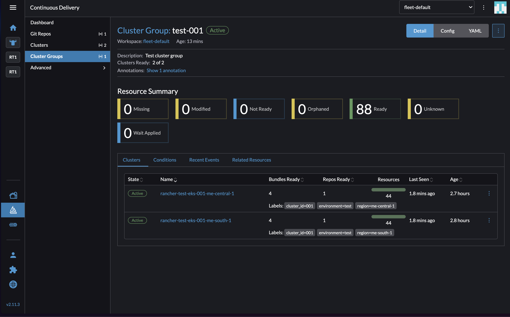
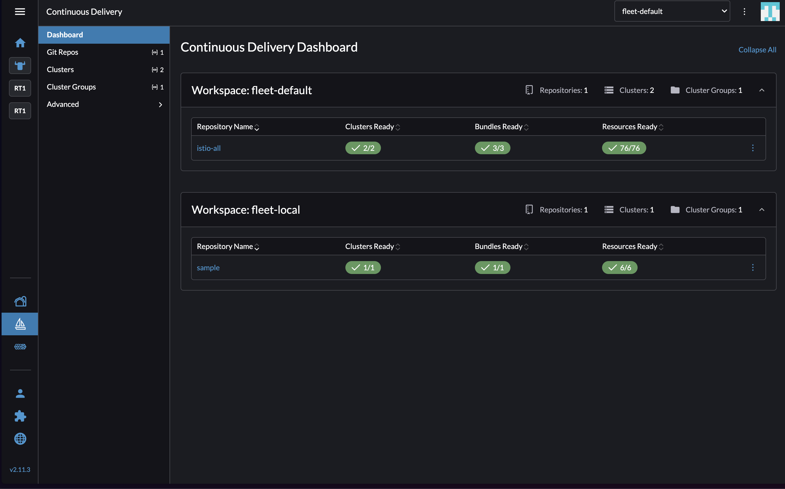
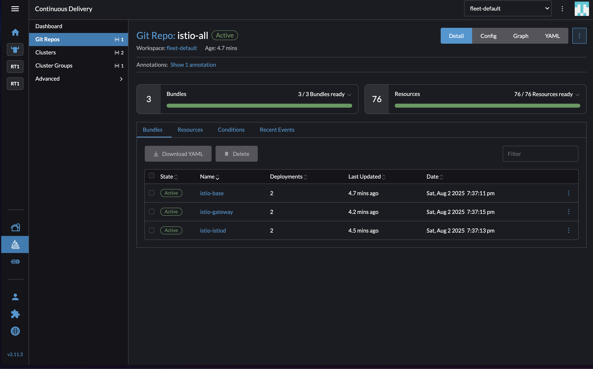

# Rancher + Multi Region EKS Deployment
- provision infrastructure using terraform
  - network - vpc & subnets (public, private w NAT)
  - rancher management server - ec2 server w k3s & rancher
  - downstream clusters - eks clusters in diff aws regions
- post-provisioning downstream cluster setup using rancher fleet
  - use fleet to create cluster groups
  - use fleet gitrepo bundles to setup
    - istio



## Folder Structure
```
.
├── fleet       # post provisioning k8s cluster setup
├── terraform   # provisioning rancher management cluster & downstreamk8s cluster
└── README.md
```

## Rancher + Multi Region EKS Deployment
- AWS IAM Policies
  - AmazonEKSComputePolicy
  - AmazonVPCFullAccess
  - AmazonEC2FullAccess
  - IAMFullAccess
  - AWSCloudFormationFullAccess
  - custom policy - * (list, describe, create, etc) on eks

```sh
# install tools
# mise - https://mise.jdx.dev/installing-mise.html
mise install

# create IAM user & attach policies defined above

# root dir - k8s-rancher
cd terraform
# 1. create vpc & subnets (public, private w NAT) in aws-me-central-1 & aws-me-south-1
cd environments/test/aws/0_network
echo "AWS_ACCESS_KEY_ID=your_access_key_id" > .env
echo "AWS_SECRET_ACCESS_KEY=your_secret_access_key" >> .env
dotenvx run -f .env -- terraform init
dotenvx run -f .env -- terraform apply -var-file=terraform.tfvars
# dotenvx run -f .env -- terraform destroy
cd -

# 2. create rancher server in aws-me-central-1 public subnet
cd environments/test/aws/1_rancher
echo "AWS_ACCESS_KEY_ID=your_access_key_id" > .env
echo "AWS_SECRET_ACCESS_KEY=your_secret_access_key" >> .env
# TODO: update vpc_id & public_subnet_id in terraform.tfvars
# pick any public subnet from aws-me-central-1
dotenvx run -f .env -- terraform init
dotenvx run -f .env -- terraform apply -var-file=terraform.tfvars
# dotenvx run -f .env -- terraform destroy
cd -
# NOTE: ssh keys & kube config file are written into terraform/environments/test/aws/1_rancher/.output

# 2.1 - access rancher ui & create api key
# NOTE: use `rancher_server_dns` output from previous step
# go to rancher ui - https://{rancher_server_dns} 
# sign in with password - adminadminadmin
# TODO: gen api key to create clusters
#  - profile picture -> account & api keys -> create API key no scope

# 3. create eks cluster in aws-me-central-1 & aws-me-south-1 public subnets
cd environments/test/aws/2_clusters
echo "AWS_ACCESS_KEY_ID=your_access_key_id" > .env
echo "AWS_SECRET_ACCESS_KEY=your_secret_access_key" >> .env
# TODO: update values in secret.tfvars
cp secret.tfvars.example secret.tfvars
# TODO: update values in terraform.tfvars
# add all public subnets from aws-me-central-1 for cluster in me-central-1 & same for aws-me-south-1
dotenvx run -f .env -- terraform init
dotenvx run -f .env -- terraform apply -var-file=terraform.tfvars -var-file=secret.tfvars
# dotenvx run -f .env -- terraform destroy
cd -
# NOTE: kube config file are written into terraform/environments/test/aws/2_clusters/.output
```

### Rancher UI after cluster deployment


### Fleet UI after cluster group
```sh
just fleet-apply-cluster-group env="test"
```


### Fleet UI after gitrepo bundles
```sh
just fleet-apply-gitrepo env="test"
```



## Architecture
### Network 
- each private subnet has a NAT gateway to avoid central point of failure when the az containing the NAT gateway is in outage
- subnets
  - 1 public subnet per az
  - 1 private subnet per az
- route tables
  - 1 public route table per region
  - 1 private route table per az

```mermaid
---
title: AWS VPC & Subnets
---
graph TD
    internet
    subgraph "Region: me-central-1"
      subgraph "VPC: me-central-1"
        me-central-1-internet-gateway
        subgraph "me-central-1a"
          subgraph "public-subnet-me-central-1a"
          end
          subgraph "private-subnet-me-central-1a"
            me-central-1a-nat-gateway
          end
        end
        subgraph "me-central-1b"
          subgraph "public-subnet-me-central-1b"
          end
          subgraph "private-subnet-me-central-1b"
            me-central-1b-nat-gateway
          end
        end
        subgraph "me-central-1c"
          subgraph "public-subnet-me-central-1c"
          end
          subgraph "private-subnet-me-central-1c"
            me-central-1c-nat-gateway
          end
        end
      end
    end
    subgraph "Region: me-south-1"
      subgraph "VPC: me-south-1"
        me-south-1-internet-gateway
        subgraph "me-south-1a"
          subgraph "public-subnet-me-south-1a"
          end
          subgraph "private-subnet-me-south-1a"
            me-south-1a-nat-gateway
          end
        end
        subgraph "me-south-1b"
          subgraph "public-subnet-me-south-1b"
          end
          subgraph "private-subnet-me-south-1b"
            me-south-1b-nat-gateway
          end
        end
        subgraph "me-south-1c"
          subgraph "public-subnet-me-south-1c"
          end
          subgraph "private-subnet-me-south-1c"
            me-south-1c-nat-gateway
          end
        end
      end
    end

    %% internet gateway %%
    me-central-1-internet-gateway <---> internet
    me-south-1-internet-gateway <---> internet

    %% nat gateway  to internet gateway %%
    me-central-1a-nat-gateway ---> me-central-1-internet-gateway
    me-central-1b-nat-gateway ---> me-central-1-internet-gateway
    me-central-1c-nat-gateway ---> me-central-1-internet-gateway
    me-south-1a-nat-gateway ---> me-south-1-internet-gateway
    me-south-1b-nat-gateway ---> me-south-1-internet-gateway
    me-south-1c-nat-gateway ---> me-south-1-internet-gateway

    %% public subnet to internet gateway  bidirectional %%
    public-subnet-me-central-1a <---> me-central-1-internet-gateway
    public-subnet-me-central-1b <---> me-central-1-internet-gateway
    public-subnet-me-central-1c <---> me-central-1-internet-gateway
    public-subnet-me-south-1a <---> me-south-1-internet-gateway
    public-subnet-me-south-1b <---> me-south-1-internet-gateway
    public-subnet-me-south-1c <---> me-south-1-internet-gateway
```



## Useful links
- [CIDR Calculator](https://cidr.xyz/)

## TODO
- terraform
  - set s3 backend
- fleet
  - add velero for k8 backups
  - add operators
  - add observability stack
  - add cluster policies
- k8s
  - add gpu & cpu node pools
  - operator with node affinity
- cluster operations
  - workload migration during cluster upgrades (k8 upgrade, mesh upgrade, etc)
- alerting
  - add alerting stack - email, slack, etc
- cluster provisioning
  - is it better to provision directly on aws & then register it on rancher? how will fleet be setup on the new cluster?
- local k3s cluster for fleet testing
  - setup rancher management cluster & downstream cluster on k3s
  - installing helm charts - [link](https://docs.k3s.io/installation/packaged-components)
  - cluster config file using [k3d](https://k3d.io/stable/usage/configfile/)

## Tools
- [terraform](https://developer.hashicorp.com/terraform)
- [rancher](https://rancher.com)
- [fleet](https://fleet.rancher.io)
- [helm](https://helm.sh)
- [k3s](https://k3s.io) - lightweight k8s on ec2 node for rancher management server

## Notes
- while running tf destroy in cluster dir it only deletes the rancher cluster registration & not the cluster
  - clusters get deleted when the vpc is deleted, i.e tf destroy in network dir
- track terraform operations on AWS CloudTrail
- track all resources in region - AWS Resource Groups

# AWS Resources
- network
  - vpc
  - vpc peering
  - route tables
  - subnets
  - security groups
  - internet gateway
  - nat gateway
- compute
  - ec2
  - ec2 autoscaling groups
  - ec2 key pairs
  - elatic ip
  - eks cluster
- cloudformation
