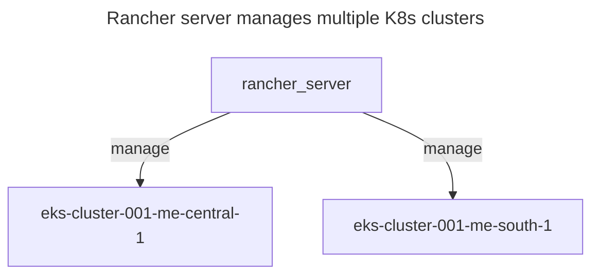

# Rancher + Multi Region EKS Deployment

```mermaid
---
title: AWS VPC & Subnets
---
graph TD
    internet
    subgraph "Region: me-central-1"
      subgraph "VPC: me-central-1"
        me-central-1-internet-gateway
        subgraph "me-central-1a"
          subgraph "public-subnet-me-central-1a"
          end
          subgraph "private-subnet-me-central-1a"
            me-central-1a-nat-gateway
          end
        end
        subgraph "me-central-1b"
          subgraph "public-subnet-me-central-1b"
          end
          subgraph "private-subnet-me-central-1b"
            me-central-1b-nat-gateway
          end
        end
        subgraph "me-central-1c"
          subgraph "public-subnet-me-central-1c"
          end
          subgraph "private-subnet-me-central-1c"
            me-central-1c-nat-gateway
          end
        end
      end
    end
    subgraph "Region: me-south-1"
      subgraph "VPC: me-south-1"
        me-south-1-internet-gateway
        subgraph "me-south-1a"
          subgraph "public-subnet-me-south-1a"
          end
          subgraph "private-subnet-me-south-1a"
            me-south-1a-nat-gateway
          end
        end
        subgraph "me-south-1b"
          subgraph "public-subnet-me-south-1b"
          end
          subgraph "private-subnet-me-south-1b"
            me-south-1b-nat-gateway
          end
        end
        subgraph "me-south-1c"
          subgraph "public-subnet-me-south-1c"
          end
          subgraph "private-subnet-me-south-1c"
            me-south-1c-nat-gateway
          end
        end
      end
    end

    %% internet gateway %%
    me-central-1-internet-gateway <---> internet
    me-south-1-internet-gateway <---> internet

    %% nat gateway  to internet gateway %%
    me-central-1a-nat-gateway ---> me-central-1-internet-gateway
    me-central-1b-nat-gateway ---> me-central-1-internet-gateway
    me-central-1c-nat-gateway ---> me-central-1-internet-gateway
    me-south-1a-nat-gateway ---> me-south-1-internet-gateway
    me-south-1b-nat-gateway ---> me-south-1-internet-gateway
    me-south-1c-nat-gateway ---> me-south-1-internet-gateway

```





AWS IAM Policies
- AmazonEKSComputePolicy
- AmazonVPCFullAccess
- AmazonEC2FullAccess
- IAMFullAccess
- AWSCloudFormationFullAccess
- custom policy - * on eks

## Rancher + Multi Region EKS Deployment
```sh
# root dir - k8s-rancher
cd terraform
# 1. create vpc & subnets (public, private w NAT) in aws-me-central-1 & aws-me-south-1
cd environments/test/aws/0_network
echo "AWS_ACCESS_KEY_ID=your_access_key_id" > .env
echo "AWS_SECRET_ACCESS_KEY=your_secret_access_key" >> .env
dotenvx run -f .env -- terraform init
dotenvx run -f .env -- terraform apply -var-file=terraform.tfvars
# dotenvx run -f .env -- terraform destroy
cd -

# 2. create rancher server in aws-me-central-1 public subnet
cd environments/test/aws/1_rancher
echo "AWS_ACCESS_KEY_ID=your_access_key_id" > .env
echo "AWS_SECRET_ACCESS_KEY=your_secret_access_key" >> .env
dotenvx run -f .env -- terraform init
dotenvx run -f .env -- terraform apply -var-file=terraform.tfvars
# dotenvx run -f .env -- terraform destroy
cd -

# 2.1 - access rancher ui & create api key
# to to rancher ui - https://{rancher_server_dns}
# sign in with password - adminadminadmin
# gen api key - profile picture -> account & api keys -> create API key

# 3. create eks cluster in aws-me-central-1 & aws-me-south-1 public subnets
cd environments/test/aws/2_clusters
echo "AWS_ACCESS_KEY_ID=your_access_key_id" > .env
echo "AWS_SECRET_ACCESS_KEY=your_secret_access_key" >> .env
# update values in secret.tfvars
cp secret.tfvars.example secret.tfvars
dotenvx run -f .env -- terraform init
dotenvx run -f .env -- terraform apply -var-file=terraform.tfvars -var-file=secret.tfvars
# dotenvx run -f .env -- terraform destroy
cd -
```

# Useful links
- [CIDR Calculator](https://cidr.xyz/)
