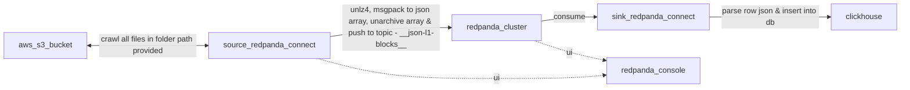

# redpanda connect s3 source

## Dataflow

```mermaid
flowchart LR
  aws_s3_bucket
  source_redpanda_connect
  sink_redpanda_connect
  redpanda_cluster
  redpanda_console
  clickhouse

  aws_s3_bucket <--crawl all files in folder path provided--> source_redpanda_connect
  source_redpanda_connect --unlz4, msgpack to json array, unarchive array & push to topic - __json-l1-blocks__--> redpanda_cluster
  source_redpanda_connect -.ui.-> redpanda_console
  redpanda_cluster -.ui.-> redpanda_console
  redpanda_cluster --consume--> sink_redpanda_connect
  sink_redpanda_connect --parse row json & insert into db--> clickhouse
```

## Run
```sh
docker compose up -d
# console - http://localhost:8080
```
