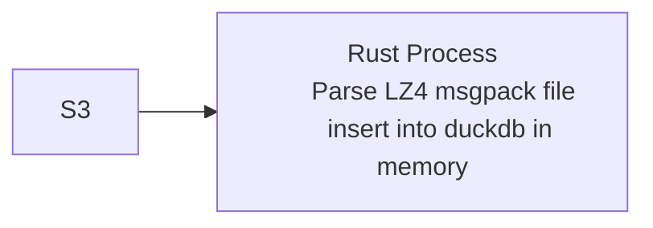

# Rust Parse LZ4 msgpack file from s3 & insert into duckdb



- s3 requester pays
- file parse - lz4 decompress, msgpack unpack, transform to serde json
- file write - serde json to local disk
- duckdb in memory

- profiling - flamegraph
  - needs xctrace (xcode)


## Run on local
```bash
mise install
# install dotenvx cli

cp .env.example .env
# update .env with your s3 credentials
just run
```

## Profiling
```bash
just flamegraph
open flamegraph.svg
```

```bash
just samply
# nice ui on browser localhost:3000
```
