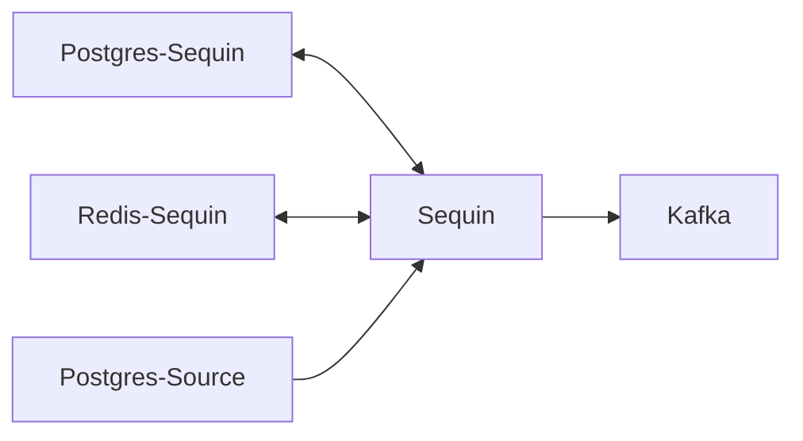

# Postgres CDC to Kafka using Sequin

__NOTE__: docker setup from [here](https://github.com/sequinstream/sequin/tree/main/docker)


## Usage
### Prerequisites
- [mise](https://mise.run/)
- [pre-commit](https://pre-commit.com/)
- [just](https://just.systems/)

### Setup
```bash
just setup
```

### Run
```bash
just up # run docker compose up
# go to sequin ui & validate sink config
just run # insert data
just down # run docker compose down
```

- Sequin UI: http://localhost:7376
- Grafana: http://localhost:3000
- Kafka UI: http://localhost:8088

### Export Sequin Config
```bash
# install cli
curl -sf https://raw.githubusercontent.com/sequinstream/sequin/main/cli/installer.sh | sh
# export config

```

## Notes
- when you set a BATCH_SIZE - ordering of events in a batch is not guaranteed
- cannot run WITHOUT redis

## Todo
- multiple tables with high volume using 1 replication slot. how does partitioning help w load
- ordering guarantee
- what happens if i run sequin without redis
- what happens if i run multiple sequin instances (clustering)
- latency in cloud deployment
- good batch size at 1000 inserts/sec
- idempotency key on backfills
- running in k8s
- nice to have
    - transforms & filters
    - audit logs

## Running in Production
- postgres
  - own logical db for sequin to store source & sink configs
- redis
  - need to track replication



## Performance
- [debezium](https://estuary.dev/blog/debezium-cdc-pain-points/)
- [sequin](https://sequinstream.com/docs/performance)
- [debezium vs sequin benchmark](https://github.com/sequinstream/sequin-vs-debezium-benchmark/tree/main)
